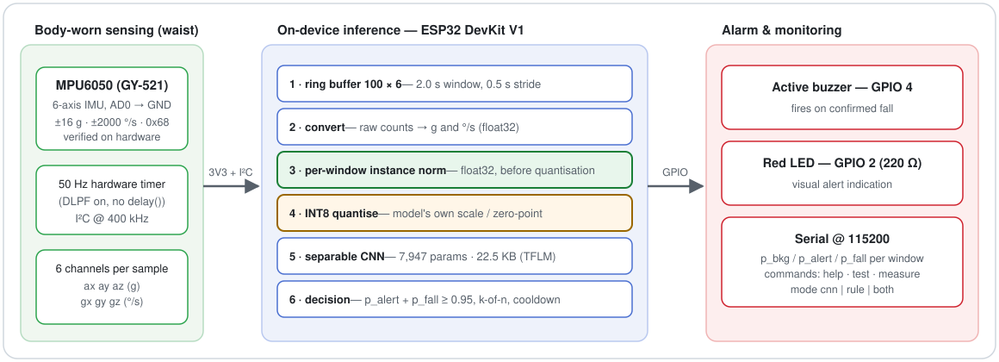
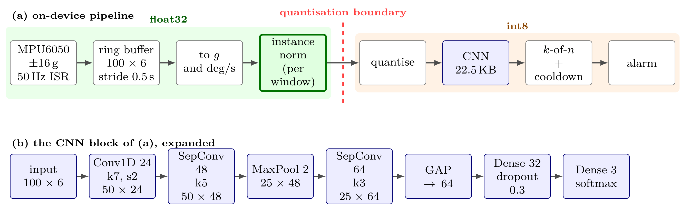
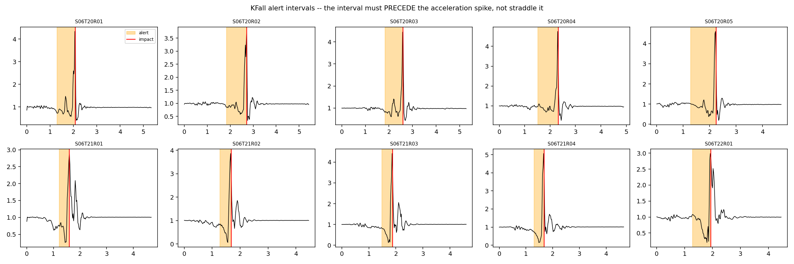
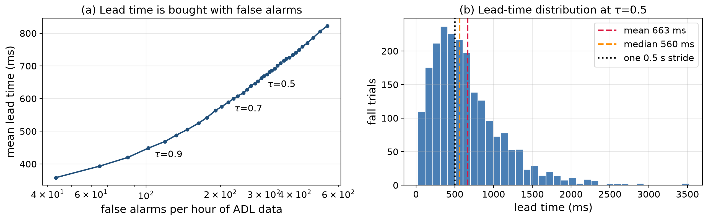
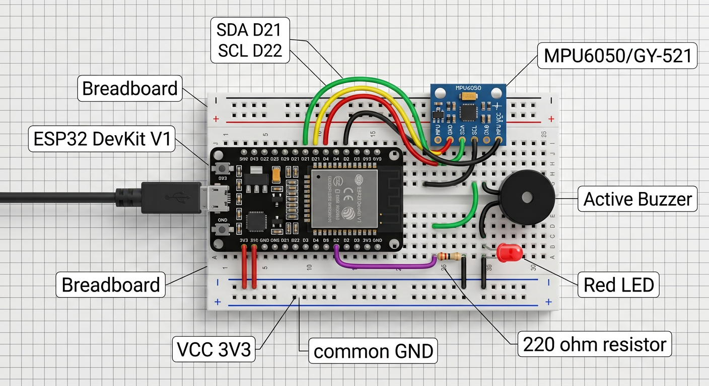

# Elderly Fall Detection on ESP32

### Pre-impact fall alerts with a 22.5 KB INT8 CNN on an ESP32 DevKit V1

[](LICENSE)
[](#hardware)
[](#system-overview)
[](#datasets)
[](#try-it-in-simulation-wokwi)

A low-cost, waist-worn inertial sensor system that detects **falls — and alerts
*before* impact** — using a compact INT8 convolutional network running entirely
on an **ESP32 DevKit V1**. When a fall is confirmed, a red LED and an active
buzzer raise the alarm.

Built from a TinyML research pipeline (four public fall datasets,
subject-grouped and leave-one-dataset-out evaluation, full INT8 quantisation),
verified on physical hardware, and reproducible end-to-end — including in the
[Wokwi](https://wokwi.com) simulator with a real dataset trial.

**In this README:** [Status](#status-at-a-glance) ·
[Wokwi demo](#try-it-in-simulation-wokwi) · [System](#system-overview) ·
[AI impact](#what-the-ai-adds) · [Results](#results-summary) ·
[Hardware](#hardware) · [Datasets](#datasets) · [Training](#training-pipeline) ·
[Quick start](#quick-start) · [Structure](#repository-structure) ·
[Limitations](#limitations) · [License](#license)

---

## Status at a glance

| Claim | Status | Evidence |
|---|---|---|
| MPU6050 + ESP32 hardware bring-up (I²C 0x68, GPIO 21/22, LED D2, buzzer D4) | **Verified on physical hardware** | `firmware/esp32_*_test*`, `docs/HARDWARE.md` |
| AI-free rule-based fall detector (free-fall + impact/rotation) | **Verified on physical hardware** | `firmware/esp32_usb_rule_based_fall_detector/`, `reports/fall_detector_ai_free_report_english.pdf` |
| Final INT8 model loads and infers on the physical ESP32, prints `p_bkg/p_alert/p_fall`, raises the alarm | **Verified on physical hardware** (USB-powered) | `firmware/esp32_ai_final_live_deployment/`, `docs/PROJECT_HANDOFF_SUMMARY.md` §8 |
| Dataset results (Tables I–IV, ablations, lead time, false alarms) on real public datasets | **Verified — Kaggle reference runs** (provenance-tracked) | `results/kaggle_reference/`, `results/tables/` |
| Committed INT8 model detects KFall trial `S06T20R01` end-to-end on desktop replay | **Verified by this repo's tooling, reproducible now** | `results/replay_verification/`, `tools/replay_desktop_check.py` |
| Final-model firmware compiles for ESP32 (replay + live modes) | **Verified build (PlatformIO)** | `wokwi/final_model/` |
| On-device latency, tensor-arena high-water mark, current draw, battery life | **PENDING — requires the bench** (protocol ready) | `experiments/hardware_measurement/`, `firmware/MEASUREMENT.md` |
| Real-world false-alarm rate (1-hour ADL wear), supervised drop trials | **PENDING — requires supervised trials** | `experiments/hardware_measurement/on_device_trials.md` |

Nothing in this repository turns a simulation result into a hardware
measurement, or a reference-pipeline result into a new experiment. Every number
has a labelled provenance trail in
[`docs/RESULTS_PROVENANCE.md`](docs/RESULTS_PROVENANCE.md).

---

## Try it in simulation (Wokwi)

The repo ships a ready-to-run Wokwi project that replays a **real labelled
KFall fall trial (`S06T20R01`)** through the committed INT8 model, with the
same preprocessing the device runs — no account or data download needed (the
268-sample excerpt is embedded in the firmware).

**Circuit (from `wokwi/final_model/diagram.json`):** ESP32 DevKit V1, MPU6050 @
0x68, active buzzer on D4, red LED on D2 via 220 Ω — identical wiring to the
physical build below.

**Run it (~10 minutes):**

```text
VS Code + PlatformIO extension + Wokwi for VS Code extension
open wokwi/final_model/
pio run                  # builds REPLAY_MODE=1 (KFall S06T20R01 embedded)
Wokwi: Start Simulator   # Ctrl+Shift+P → "Wokwi: Start Simulator"
```

**What you will see:** the trial streams at 50 Hz through the 100×6 sliding
window; when the fall phase enters the window the buzzer and LED fire, and the
serial console prints the lead time against the video-grounded impact label.
The desktop twin of this exact run (same model, same preprocessing, INT8
arithmetic identical to the device) is committed and reproducible:

| Window right edge | Time | p_bkg | p_alert | p_fall |
|---:|---:|---:|---:|---:|
| 99  | 1.98 s | 0.0781 | **0.9219** | 0.0000 |
| 124 | 2.48 s | 0.0000 | 0.0000 | **0.9961** |
| 149 | 2.98 s | 0.0000 | 0.0000 | **0.9961** |
| 174 | 3.48 s | 0.0039 | 0.0000 | **0.9961** |

Impact is labelled at sample 104 → the first alarm fires at sample 99, i.e.
**100 ms before impact** (threshold ≤ 0.9, k=1). Reproduce the table yourself:

```bash
python -m venv .venv && .venv/bin/pip install tensorflow
.venv/bin/python tools/replay_desktop_check.py \
    --model models/final_int8/model.tflite \
    --replay wokwi/final_model/src/replay_data.h \
    --norm instance --threshold 0.95 --k 2
```

Full guide: [`docs/WOKWI.md`](docs/WOKWI.md) · verification report:
[`results/replay_verification/REPLAY_VERIFICATION.md`](results/replay_verification/REPLAY_VERIFICATION.md)

> **Honesty note:** Wokwi replay verifies model/firmware integration on a real
> dataset trial. It is *not* real-world validation — it says nothing about
> sensor noise, mounting, or battery behaviour. See
> [`docs/LIMITATIONS.md`](docs/LIMITATIONS.md).

---

## System overview



The signal path, from the frozen preprocessing contract to the model — the same
figure used in the manuscript:



<sub>Top: float32 pipeline up to the quantisation boundary, INT8 afterwards.
Bottom: the 7,947-parameter separable CNN (`models/final_int8/`).</sub>

**The frozen technical contract** — the agreement between training and
firmware; a mismatch is silent and fatal:

```text
Sampling rate   : 50 Hz (MPU6050 divider 19, DLPF on; hardware timer, no delay())
Channels        : ax, ay, az (g), gx, gy, gz (deg/s); accel ±16 g, gyro ±2000 dps
Window          : 100 samples x 6 channels (2.0 s)
Stride          : 25 samples (0.5 s)
Classes         : bkg / alert / fall (alarm = p_alert + p_fall)
Normalisation   : PER-WINDOW instance normalisation, in float, before quantisation
Model           : separable CNN, 7,947 params, INT8 23,080 bytes (22.54 KB)
Preprocess sig  : 2574e6104c95
Default point   : threshold 0.95, k = 2  (switch live: `thr`, `k`)
Parallel mode   : AI-free rule-based detector for head-to-head comparison (`mode cnn|rule|both`)
```

**Do not** mix the final model with global/frozen-constant normalisation, or
the legacy model with instance normalisation. The final supported deployment
combination is pinned in
[`docs/DEPLOYMENT.md`](docs/DEPLOYMENT.md#final-supported-deployment-combination).

---

## What the AI adds

The device runs a classical threshold detector **and** the INT8 CNN on the same
sensor stream, so the comparison is measured head-to-head, not asserted:

| Comparison | Classical / threshold | INT8 CNN | Source |
|---|---:|---:|---:|
| Pre-impact task, KFall (macro-F1) | 0.3262 (SMV threshold) | **0.8742** | Table I(b) |
| KFall trial-level vs Yu (2021) benchmark | 0.9550 / 0.8343 / 333 ms | **0.9962 / 0.9465 / 393 ms** | trial-level eval |
| Post-fall task, SisFall (macro-F1) | 0.4837 (SMV threshold) | **0.9502** | Table I |

The AI's contribution is *detection before impact, on cheap hardware* — what a
threshold cannot do — while its two known weaknesses (false alarms/hour,
cross-dataset shift) are measured and reported, not hidden. The alert interval
must **precede** the impact spike, not straddle it:



Full analysis: [`docs/AI_IMPACT.md`](docs/AI_IMPACT.md). On-device CNN-vs-rule
trials (`mode both`) are the pending bench protocol in
`experiments/hardware_measurement/`.

---

## Results summary

From the reference Kaggle runs on the four real datasets (provenance in
`results/kaggle_reference/`, per-number audit in
[`docs/RESULTS_PROVENANCE.md`](docs/RESULTS_PROVENANCE.md)):

- **Within-dataset:** macro-F1 is saturated (0.95–0.98); the proposed
  7,947-param model reaches 0.9502 grouped-5-fold on SisFall (Table I).
- **Leave-one-dataset-out is much harder and asymmetric:** F1 0.34 on unseen
  FallAllD vs 0.84 on unseen KFall; per-window instance normalisation is the
  only adaptation rung that helps (Table II).
- **Pre-impact (the headline):** 663 ms mean lead at threshold 0.5, detecting
  91.8% of 2,346 KFall fall trials pre-impact — at ~293 false alarms/hour;
  the threshold/*k* trade-off and honest false-alarm analysis are in
  `results/tables/debounce_analysis.md` (Table III).
- **Deployment size:** INT8 22.54 KB, ~8 KB tensor arena (desktop estimate),
  FP32→INT8 agreement 99.4% — on-device latency/RAM/current/battery numbers
  are **pending** (`experiments/hardware_measurement/`).
- **This repo's own verification:** the committed INT8 model replayed through
  the exact firmware preprocessing flags KFall `S06T20R01` pre-impact
  (+100 ms at threshold ≤ 0.9, k=1) and scores 0.9961 fall probability across
  the impact windows — `results/replay_verification/REPLAY_VERIFICATION.md`.



<sub>Left: mean lead time vs false-alarm cost across thresholds. Right:
lead-time distribution at τ=0.5 (mean 663 ms, median 560 ms) — 2,346 KFall
fall trials.</sub>

---

## Hardware



| Component | Connection | Notes |
|---|---|---|
| MPU6050 VCC | ESP32 3V3 | **never 5 V** |
| MPU6050 GND | GND | common ground |
| MPU6050 SDA | GPIO 21 / D21 | I²C data |
| MPU6050 SCL | GPIO 22 / D22 | I²C clock 400 kHz |
| MPU6050 AD0 | GND | address 0x68 (verified on the physical build) |
| Buzzer + | GPIO 4 / D4 | active buzzer |
| LED anode | GPIO 2 / D2 via 220 Ω | red LED |
| Power | USB | battery (TP4056 + 1000 mAh LiPo) is the optional next step |

Wiring diagrams, BOM and pin sheets: [`hardware/`](hardware/) ·
build/test guide: [`docs/HARDWARE.md`](docs/HARDWARE.md).

---

## Datasets

**All four raw datasets are vendored directly inside the repo tree** — cloning
gets you the data, no account or login anywhere:

| Dataset | Path | Contents | Obligation |
|---|---|---|---|
| **SisFall** | `datasets/sisfall/` | complete official release: 38 subjects, 4,505 trial `.txt` files | cite Sucerquia et al. 2017 |
| **KFall** | `datasets/kfall/` | 5,075 trials / 32 subjects: 100 Hz sensor CSVs + video-grounded onset/impact `.xlsx` labels | cite Yu et al. 2021; upstream asks users to register — `kfall/NOTICE.md` |
| **FallAllD** | `datasets/fallalld/` | official `FallAllD.pkl` + 40 Hz variant + `activity_info.pkl` (split into ≤95 MiB `.part-*` chunks) | cite Saleh et al. 2020; upstream = IEEE DataPort |
| **UMAFall** | `datasets/umafall/` | 746 trial `.csv` files (corrected version) | CC BY 4.0 — cite Casilari et al. 2017 |

GitHub rejects files over 100 MB, so the two large FallAllD pickles are
chunked — one `cat` rebuilds the byte-exact, checksummed originals:

```bash
cd datasets/fallalld
cat FallAllD.pkl.part-* > FallAllD.pkl
cat FallAllD_40SamplesPerSec_ActivityIdsFiltered.pkl.part-* > \
    FallAllD_40SamplesPerSec_ActivityIdsFiltered.pkl
```

Dataset roles (pre-impact source / training corpus / LODO fold / held-out
stress test), parsers, layouts and licences: [`datasets/README.md`](datasets/README.md)
· single-file zips for the first two: [`datasets-v1` release](https://github.com/meherabmehu/elderly_fall_detection/releases/tag/datasets-v1)
· checksums: `datasets/SHA256SUMS.txt`.

---

## Training pipeline

```text
raw datasets (datasets/)  ->  training/src/fdlib (frozen 50 Hz / 100x6 preprocessing)
  ->  Kaggle notebooks nb00..nb07 (probe, preprocess, E1/E2/E3/E5 experiments,
      INT8 export, final model)  ->  models/final_int8/model.tflite + model.h
```

- `training/src/fdlib/` — the shared library (preprocessing contract, dataset
  parsers, models, baselines, metrics, fold runner, TFLite export)
- `training/kaggle/nb00_probe … nb07_final/` — the exact scripts that produced
  every result, run via `training/scripts/run_kernel.py`
- Run log: `results/kaggle_reference/experiment_log.csv` · re-run guide:
  [`docs/REPRODUCIBILITY.md`](docs/REPRODUCIBILITY.md) (Level 3)
- The deployed model (23,080-byte INT8, 7,947 params) and its model card:
  [`models/final_int8/README.md`](models/final_int8/README.md)

---

## Quick start

**1 · Simulate (Wokwi)** — see [*Try it in simulation*](#try-it-in-simulation-wokwi) above.

**2 · Flash the physical device (Arduino IDE)**

Copy `firmware/esp32_ai_final_live_deployment/` (with its `model.h` and
`norm_constants.h`) into a sketch folder, install the **TensorFlowLite_ESP32**
library, flash, open Serial at **115200**. Type `help`, then `test`, then
`measure` after ~8 minutes for the device instrumentation. Full guide:
[`docs/DEPLOYMENT.md`](docs/DEPLOYMENT.md).

**3 · Desktop replay verification (no hardware)** — see the command block in
the [Wokwi section](#try-it-in-simulation-wokwi) above.

**4 · Reproduce the full training/evaluation pipeline** — scripted under
[`training/`](training/), runs on Kaggle GPU; datasets are already in
[`datasets/`](datasets/).

---

## Repository structure

```text
├── docs/                  all documentation (start: KNOWLEDGE_MAP.md) + images/
├── datasets/              all four raw datasets vendored in-tree (+ checksums, notices)
├── training/              fdlib pipeline: library, Kaggle notebooks, scripts
├── results/               Kaggle reference results, tables, replay verification
├── models/                final_int8/ (deployed) + legacy_synthetic/ (superseded)
├── firmware/              ESP32 sketches: final live AI, rule-based, demo, bring-up
├── wokwi/                 Wokwi projects: final_model/ (recommended) + legacy
├── experiments/           pending hardware measurement templates + future logs
├── tools/                 replay checker, serial capture, measure-log parser, dataset fetch
├── hardware/              wiring diagrams, BOM, pin connection sheets
├── reports/               project reports (AI-free report, proposal report, …)
├── presentations/         20-minute English / Bangla presentation scripts
├── paper_support/         manuscript source, paper-ready tables/figures, refs
└── legacy/                superseded synthetic-pipeline snapshot (provenance)
```

**Where to read next:** [`docs/KNOWLEDGE_MAP.md`](docs/KNOWLEDGE_MAP.md) (map of
everything) · [`docs/METHODOLOGY.md`](docs/METHODOLOGY.md) ·
[`docs/SYSTEM_ARCHITECTURE.md`](docs/SYSTEM_ARCHITECTURE.md) ·
[`docs/EXPERIMENTS.md`](docs/EXPERIMENTS.md) · [`docs/PAPER_GUIDE.md`](docs/PAPER_GUIDE.md)
· [`docs/PROJECT_HANDOFF_SUMMARY.md`](docs/PROJECT_HANDOFF_SUMMARY.md)

---

## Limitations

*Read before citing.*

1. **On-device resource numbers are pending.** Latency, tensor-arena
   high-water mark, current and battery life are instrumented in the firmware
   with a documented measurement protocol, but have **not yet been measured on
   the bench** — they appear as `PENDING` everywhere, on purpose.
2. **Wokwi replay ≠ real-world validation.** It verifies model/firmware
   integration on a real dataset trial; it says nothing about sensor noise,
   mounting, or battery behaviour.
3. **Datasets are simulations of falls, not elderly falls.** Public fall
   corpora are mostly young-adult, supervised, soft-surface falls; see
   [`docs/LIMITATIONS.md`](docs/LIMITATIONS.md).
4. **The legacy model (`models/legacy_synthetic/`) was trained on synthetic
   data.** Its results are kept for provenance only and must not be reported
   as dataset results.
5. **Cross-dataset generalisation is genuinely hard** (Table II); do not quote
   within-dataset numbers as deployment expectations.

Full list: [`docs/LIMITATIONS.md`](docs/LIMITATIONS.md).

## License

This repository's own code and documentation are released under the
[MIT License](LICENSE). The datasets under `datasets/` remain the property of
their respective publishers and are governed by their own licences and terms —
see the `NOTICE.md` in each dataset folder and
[`datasets/README.md`](datasets/README.md).

## Provenance and attribution

The training pipeline and most quantitative methodology results originate from
the reference repository
[`arifshekhk8/preimpact-fall-detection-tinyml`](https://github.com/arifshekhk8/preimpact-fall-detection-tinyml)
(co-authored by this project's team). This repository adds the ESP32/Wokwi
integration, hardware bring-up, replay verification tooling, and the
documentation/measurement framework for the conference submission. Details:
[`ATTRIBUTION.md`](ATTRIBUTION.md) · [`docs/RESULTS_PROVENANCE.md`](docs/RESULTS_PROVENANCE.md).

## Citations

Using the datasets obliges citing Sucerquia et al. 2017 (SisFall), Musci et
al. 2018/2020 (SisFall Enhanced annotations), Yu et al. 2021 (KFall), Saleh et
al. 2020 (FallAllD) and Casilari et al. 2017 (UMAFall). BibTeX:
[`paper_support/refs.bib`](paper_support/refs.bib).

## Safety

This is a research prototype, **not a certified medical device**. Test only
with safe, supervised, soft-surface protocols. Do not deliberately fall, and
never use this device as the sole safeguard for a person at risk of falling.
