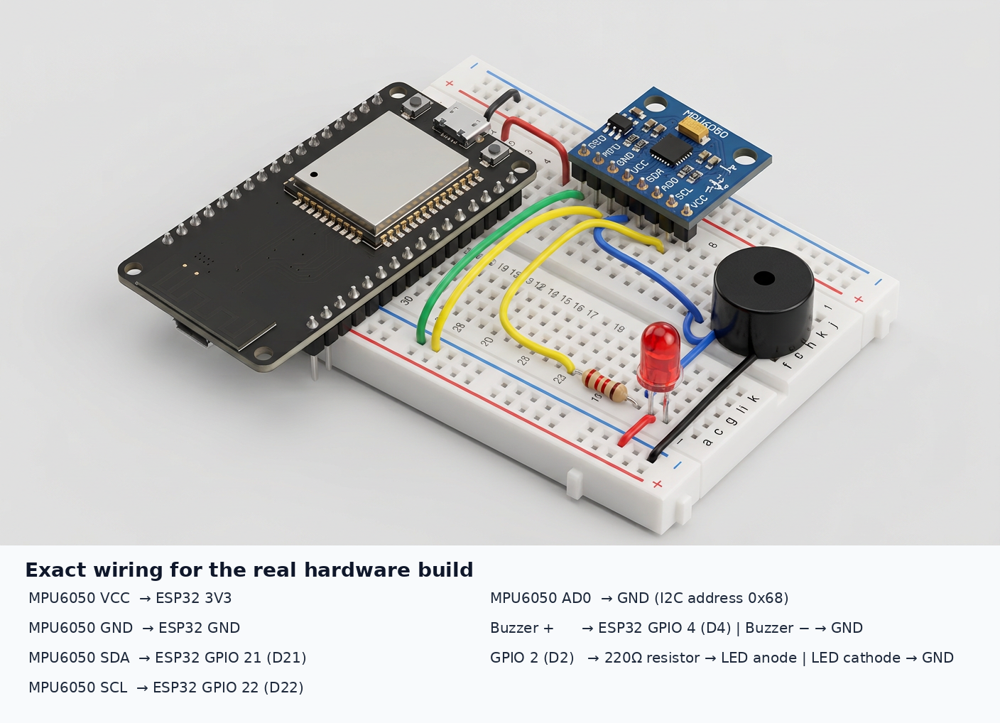

> # ⚠️ LEGACY SNAPSHOT — GEN-1 (superseded), kept for provenance only
>
> This folder preserves the project's first end-to-end pipeline exactly as it
> shipped in August 2026. Its model was trained on **synthetic** dataset
> mirrors and uses **frozen global normalisation**. Its README below (unaltered)
> describes that pipeline in its own terms.
>
> - All metrics reported in this folder's `results/` are **synthetic-pipeline
>   numbers** and must not be cited as real-dataset results.
> - The current, supported generation is GEN-2: real public datasets +
>   per-window instance normalisation — see the repository root README and
>   `docs/KNOWLEDGE_MAP.md` §2.
> - Use `models/final_int8/` + `firmware/esp32_ai_final_live_deployment/` for
>   anything real. Nothing here should be deployed.
> - The snapshot's own `push_to_github.ps1` (a Windows helper that force-pushed
>   this snapshot to a different repository) was deliberately not copied over —
>   it is environment-specific and superseded by this repository.
>
> ---

# Pre-Impact Fall Detection on ESP32 (legacy pipeline)

A low-cost wearable inertial-sensor system for detecting fall-related motion and pre-impact alert states with a compact INT8 TinyML model running on an ESP32 DevKit V1.

> **Current status:** Kaggle training completed, INT8 model exported, ESP32 firmware compiled, Wokwi circuit verified, and a real KFall trial replayed successfully through the trained model.

---

## 1. System overview

```text
MPU6050 / GY-521
        |
        | 6 channels: ax ay az gx gy gz
        | I2C, 400 kHz, 50 Hz
        v
ESP32 DevKit V1
        |
        | 2-second rolling window: 100 x 6
        | frozen normalization + INT8 quantization
        v
TensorFlow Lite Micro model
        |
        | class probabilities
        v
non-fall / alert / fall
        |
        +--> Red LED
        +--> Active buzzer
```

The model receives six inertial channels:

```text
ax, ay, az, gx, gy, gz
```

The firmware uses a 2-second window at 50 Hz and performs inference every 25 new samples, equivalent to a 0.5-second stride.

---

## 2. Hardware circuit



### Pin connections

| Component | Pin | ESP32 connection | Purpose |
|---|---|---|---|
| MPU6050 | VCC | 3V3 | Sensor power; do not use 5 V on the I2C sensor lines |
| MPU6050 | GND | GND | Common ground |
| MPU6050 | SDA | GPIO 21 / D21 | I2C data |
| MPU6050 | SCL | GPIO 22 / D22 | I2C clock |
| MPU6050 | AD0 | GND | I2C address becomes `0x68` |
| Active buzzer | + | GPIO 4 / D4 | Alarm output |
| Active buzzer | - | GND | Common ground |
| LED anode | + through 220 ohm resistor | GPIO 2 / D2 | Status/alarm indicator |
| LED cathode | - | GND | Common ground |

All grounds must be connected together. If the buzzer draws more than approximately 12 mA, drive it through a transistor instead of directly from the GPIO.

### Optional battery circuit

```text
LiPo +   -> TP4056 B+
LiPo -   -> TP4056 B-
TP4056 OUT+ -> ESP32 VIN/5V input (verify your board regulator)
TP4056 OUT- -> ESP32 GND
```

Use a protected TP4056 board. Do not connect the LiPo directly to the ESP32 3V3 pin.

---

## 3. Repository structure

```text
.
├── README.md
├── data/
│   ├── DATASETS.md
│   └── README_KAGGLE.md
├── notebooks/
│   ├── kaggle_training_fixed.ipynb
│   └── kaggle_training_original.ipynb
├── src/
│   ├── config.py
│   ├── model.py
│   ├── preprocessing.py
│   ├── parsers.py
│   ├── adaptation.py
│   ├── baselines.py
│   ├── e1.py
│   ├── e2.py
│   ├── e3.py
│   ├── e4.py
│   ├── e5.py
│   ├── plotting.py
│   └── tables.py
├── models/
│   ├── model.tflite
│   ├── proposed_fp32.keras
│   └── frozen_normalization.json
├── firmware/
│   ├── live/main.cpp
│   ├── replay/main.cpp
│   ├── replay/replay_data.h
│   ├── model_data.h
│   └── model_config.h
├── wokwi/
│   ├── diagram.json
│   ├── platformio.ini
│   ├── wokwi.toml
│   ├── model/
│   └── src/
├── results/
│   ├── e1_summary.json
│   ├── e2_summary.json
│   ├── e3_KFall_summary.json
│   ├── e4_summary.json
│   ├── e5_summary.json
│   ├── results.csv
│   └── fall_detection_project_report.docx
└── docs/
    ├── CITATIONS.md
    ├── REPRODUCIBILITY.md
    └── wiring_diagram.png
```

---

## 4. Dataset sources

Raw datasets were not copied into this legacy snapshot — the repository root
now vendors all four under `datasets/` (see `datasets/README.md`). Download
originals from the authorised sources and follow their terms and citation
requirements.

- **SisFall Enhanced:** [Kaggle](https://www.kaggle.com/datasets/nvnikhil0001/sisfall-enhanced/data)
- **KFall:** [Official KFall page](https://sites.google.com/view/kfalldataset/home)
- **FallAllD:** [IEEE DataPort](https://ieee-dataport.org/open-access/fallalld-comprehensive-dataset-human-falls-and-activities-daily-living)
- **UMAFall:** [Figshare](https://figshare.com/articles/dataset/UMA_ADL_FALL_Dataset_zip/4214283)

See [`data/DATASETS.md`](data/DATASETS.md) for expected folder layouts and acquisition notes.

KFall raw data and labels must not be transferred to third parties or committed to a public repository.

---

## 5. Training and evaluation

The Kaggle notebook uses the four real datasets and creates the following outputs:

```text
model.tflite
proposed_fp32.keras
frozen_normalization.json
model_data.h
model_config.h
```

Training protocol:

```text
Working rate: 50 Hz
Window: 2.0 seconds = 100 samples
Stride: 0.5 seconds = 25 samples
Input: 100 x 6
Classes: non-fall, alert, fall
Optimizer: Adam
Initial learning rate: 1e-3
Quantization: full integer INT8
```

Run instructions are in [`data/README_KAGGLE.md`](data/README_KAGGLE.md).

### Important evaluation limitations

- The supplied SisFall archive is pre-windowed and does not contain original subject IDs; strict 38-subject SisFall LOSO is therefore not claimed.
- KFall is the primary source for temporal pre-impact labels.
- FallAllD and UMAFall do not provide the same authoritative frame-level onset/impact labels as KFall.
- Wokwi verifies firmware/model integration; it does not replace physical latency, RAM, battery, or sensor-noise measurement.

---

## 6. Wokwi simulation

The Wokwi project is in [`wokwi/`](wokwi/).

Open the folder with VS Code and PlatformIO:

```text
wokwi/
├── diagram.json
├── platformio.ini
├── wokwi.toml
├── model/
└── src/
```

Build:

```powershell
& "$env:USERPROFILE\.platformio\penv\Scripts\pio.exe" run
```

Start the simulator from VS Code:

```text
Ctrl + Shift + P
→ Wokwi: Start Simulator
```

The verified replay firmware uses:

```cpp
#define REPLAY_MODE 1
```

It replays KFall trial `S06T20R01` through the trained model. For live MPU6050 input, use the live firmware or set:

```cpp
#define REPLAY_MODE 0
```

### Expected startup output

```text
MPU6050 READY
Loading INT8 TensorFlow Lite model...
INT8 model loaded successfully
REPLAY MODE ENABLED
Dataset: KFall
Trial: S06T20R01
SYSTEM READY
```

Then the firmware prints:

```text
p_nonfall=... p_alert=... p_fall=...
```

When `p_alert` or `p_fall` reaches the configured threshold of `0.60`, the alarm output is activated.

---

## 7. Physical ESP32 setup

1. Assemble the circuit using the pin table above.
2. Connect ESP32 to the computer with USB.
3. Open the `wokwi/` PlatformIO project.
4. For live hardware, use the firmware with `REPLAY_MODE 0`.
5. Build:

```powershell
& "$env:USERPROFILE\.platformio\penv\Scripts\pio.exe" run
```

6. Identify the ESP32 COM port in Windows Device Manager.
7. Upload:

```powershell
& "$env:USERPROFILE\.platformio\penv\Scripts\pio.exe" run --target upload --upload-port COMx
```

Replace `COMx` with the actual port.

8. Open the serial monitor:

```powershell
& "$env:USERPROFILE\.platformio\penv\Scripts\pio.exe" device monitor --port COMx --baud 115200
```

9. Confirm:

```text
I2C device found at address: 0x68
MPU6050 READY
INT8 model loaded successfully
SYSTEM READY
```

10. Test only on a safe soft surface. Do not deliberately drop or injure a person for testing.

---

## 8. Deployment measurements still required

The following must be measured on the physical ESP32 rather than inferred from Wokwi:

```text
Actual inference latency over 1,000 runs
Tensor arena peak RAM
Sensor-to-buzzer end-to-end latency
Battery runtime with a charged 1000 mAh cell
FP32 versus INT8 accuracy on the same held-out set
```

---

## 9. Results snapshot

The exported INT8 artifact has:

```text
Parameters: 8,219
INT8 model size: approximately 19.46 KB
Estimated tensor memory: approximately 25.19 KB
FP32 to INT8 F1 delta: approximately 1.07 percentage points
```

Full summaries are in [`results/`](results/), and the organized proposal report is [`results/fall_detection_project_report.docx`](results/fall_detection_project_report.docx).

---

## 10. Citations

See [`docs/CITATIONS.md`](docs/CITATIONS.md) for the dataset and related-work references.
